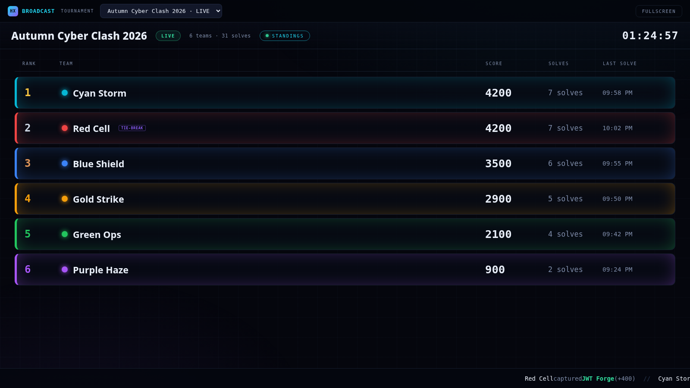
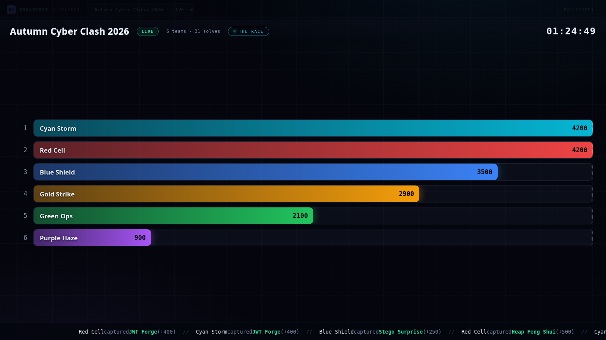
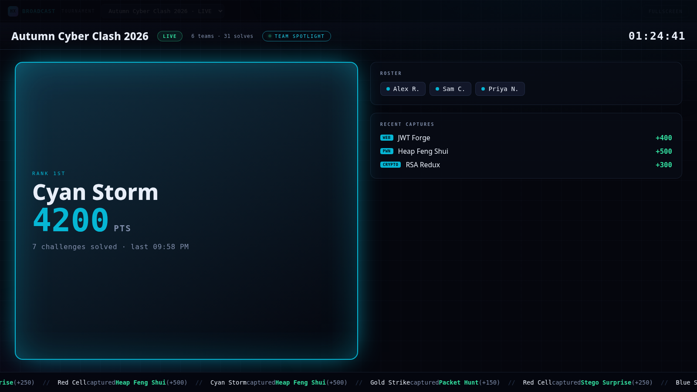
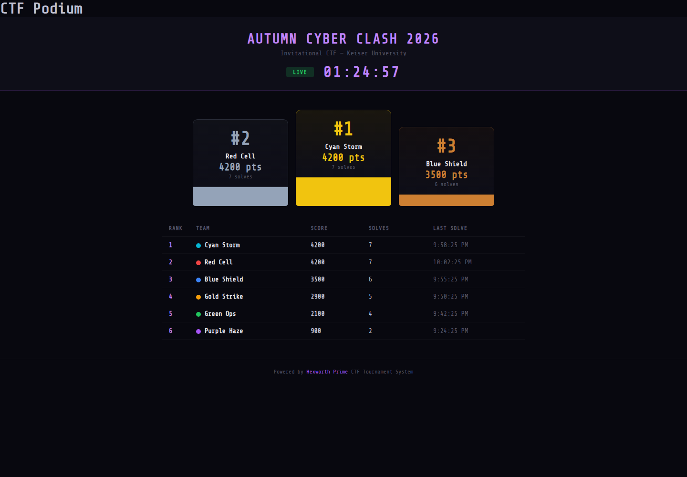
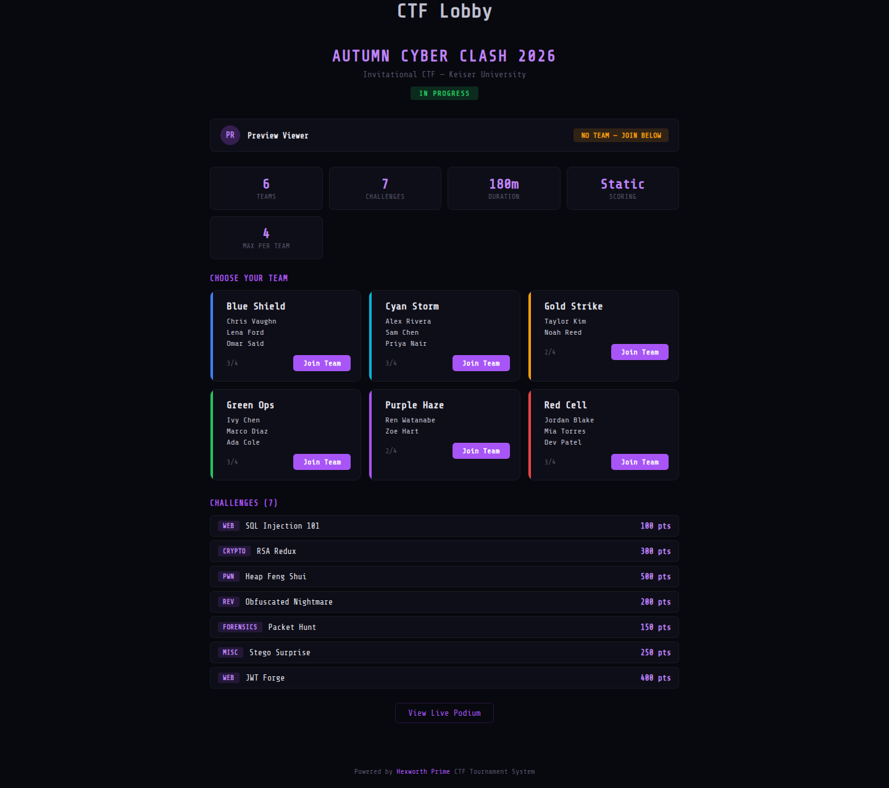
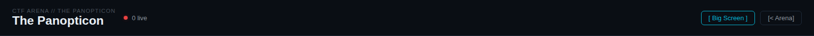

# Tournament Broadcast ("Big Screen")

**TLDR:** A produced, zero-scroll, auto-rotating big-screen channel for a live CTF event. Pick a
tournament and it takes over the projector, cycling Standings, the Race, and per-team Spotlights with
a live countdown and a solve ticker. No mouse, no manual scrolling. Data-driven (Phase A) — no video.

| | |
|---|---|
| **Live** | https://hexworth.com/arena/broadcast.html |
| **Entry point** | The Panopticon (`_app/arena/spectator.html`) header → `[ Big Screen ]` |
| **Source** | `_app/arena/broadcast.html` |
| **Access** | Public display page (anonymous sign-in for the auth-gated solve feed); mirrors the podium |
| **Ships** | `1fecce72a` (broadcast), `5e84c9b6f` (Big Screen link), `8994812ff` (XSS hardening) |

---

## What it is

The tournament view used to be a single long leaderboard you had to scroll. The broadcast replaces that
with a **director** that auto-rotates zero-scroll scenes, styled for projection at the event (dark, team
colors, legible from across the room). It reads the live tournament straight from Firestore — no export,
no build step — so what is on screen is always current.

It is a sibling of the Panopticon (the internal stream gallery), not a replacement: the Panopticon shows
individual live streams; the broadcast is the produced channel. They are linked, not merged.

## How to run it (operator)

1. Open the **Panopticon** from the CTF Arena.
2. Click **`[ Big Screen ]`** in the header (accent link, kept distinct from the page's own "Go Live"
   screen-share button).
3. **Pick a tournament** from the dropdown. It auto-selects a live/frozen event if there is exactly one.
4. Hit **Fullscreen** and point the projector at it. The director rotates scenes on its own and the
   operator control strip fades out after a few seconds of no mouse movement.

Direct URL (no Panopticon): `https://hexworth.com/arena/broadcast.html`.

## Scenes

| Scene | Shows | Duration |
|-------|-------|----------|
| **Standings** | Full leaderboard: rank, team color, score, solves, last-solve time; tie-break tags | ~9s |
| **The Race** | Each team as a bar scaled to the leader — a gap read (who is catching whom) | ~8s |
| **Team Spotlight** | One team at a time: rank, score, roster, recent captures (rotates every team) | ~6.5s each |

A persistent **HUD** (name, status, live countdown, team/solve counts) and a bottom **solve ticker** run
across all scenes.

## Screenshots

Rendered from the shipped page with representative sample data (illustrative team names/figures; not a
real event). Regenerable — see "Regenerating the screenshots" below.

**Standings** — note the tie-break: Cyan Storm and Red Cell are both on 4200, and Red Cell carries the
`TIE-BREAK` tag because Cyan reached the score first (the canonical rule from BUG-022).



**The Race** — the gap read; the operator control strip has auto-dimmed for projection.



**Team Spotlight** — rosters show as "Alex R.", "Sam C." (first name + last initial) since this is a
public URL and competitors may be minors.



**Live Podium** (`_app/arena/tournament-podium.html`) — the student-facing podium, same canonical ranking.



**Registration Lobby** (`_app/arena/tournament-lobby.html`) — Choose Your Team, rosters, join buttons,
challenge list.



**Entry point** — the `[ Big Screen ]` link in the Panopticon header.



## What is built in

- **Zero-scroll director** — scenes auto-rotate with crossfades; scene rotation is independent of data
  updates, so a live score change never resets the rotation or flickers.
- **Hard scoreboard freeze** — when the tournament status is `frozen`, the board + ticker lock to where
  they stood (snapshot) and the true finish is revealed at `ended`. Display-level freeze: the underlying
  `teams` collection stays a public read (as it is for the podium), so it is presentation control, not a
  data-access lock.
- **Roster privacy** — player names render as first-name + last-initial, with email fallbacks redacted,
  safe for a public, projected screen. See `shortName()` in `broadcast.html`.
- **Correct standings** — ranking uses the canonical tie-break (`_app/components/CtfStandings.js`
  `rankTeams()`: score DESC, then earliest `lastSolveTime` ASC), the same rule that feeds trophies and
  credentials (BUG-022).
- **Security-hardened** — the flag (`submittedFlag`) is never rendered; every team field is escaped or
  coerced before display (numbers via `Number()||0`, colors hex-whitelisted, arrays `Array.isArray`-
  guarded, the team doc id slug-validated). See BUG-023 / BUG-025.

## Data model (read-only)

```
tournaments/{id}            = { name, description, status(draft|lobby|active|frozen|ended),
                                startTime, duration(min), createdAt }
tournaments/{id}/teams/{id} = { name, color, score, solves:[chId], lastSolveTime,
                                members:[uid], memberNames:[] }
tournaments/{id}/challenges = { title, category, points, order, ... }
tournaments/{id}/submissions= { teamId, teamName, challengeId, correct, points, timestamp,
                                submittedFlag (SECRET — never rendered) }
```

Read rules (`firestore.rules`): `tournaments` / `teams` / `challenges` are public reads; `submissions`
requires auth (satisfied by the page's anonymous sign-in).

## Deferred / not built

- **Phase B — live video peeks** (Captain Cam / Quad / Team View in team-colored frames). Deferred: the
  platform has no `captain` field (always null) and no tournament↔stream workflow yet, so those scenes
  would render on data that does not exist. The uid→team display-time join is ready when those decisions
  are made.
- **BUG-024 root-fix** — the `teams.create` rule accepts arbitrary fields/types and an attacker-chosen
  doc id; the client hardening above is defense-in-depth. The durable fix constrains the team doc shape +
  id format in `firestore.rules`. Tracked in `_docs/operations/BUG_TRACKER.md`.

## Regenerating the screenshots

The screenshots are genuine renders of the shipped pages, captured headless (puppeteer + Chrome) against
a **local** copy of `_app/` with a **mock Firebase** injected (representative sample data, zero production
writes). The harness lives at `_tools/preview/capture-tournament.js` (+ `gen-preview.js` for the preview
page). Run:

```
NODE_PATH=$(pwd)/node_modules node _tools/preview/capture-tournament.js
```

To edit the sample data (team names, scores, challenges), edit the `MOCK_FIREBASE` block in that file.

## Related

- Podium / trophies / credential integrity: BUG-022 (canonical tie-break), HCA design doc
  `_docs/architecture/hexworth-credential-authority.md`.
- Security: BUG-023 / BUG-024 / BUG-025 in `_docs/operations/BUG_TRACKER.md`.
